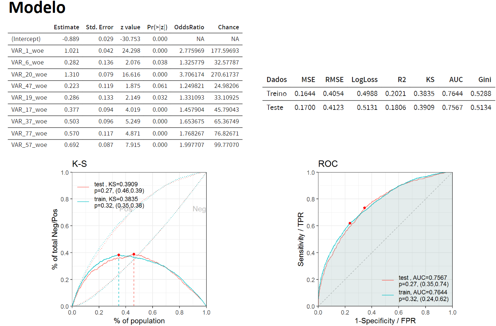

## Modelagem de Credit Scoring com Regressão Logística via WoE

Este repositório contém os recursos e resultados da modelagem de credit scoring utilizando uma regressão logística por WoE (Weight of Evidence), bem como uma variedade de análises exploratórias e diagnósticos. O modelo fornece o risco de crédito de um cliente através da probabilidade de inadimplência e scoring.

  
**Para visualizar a análise interativa, acesse [este link](https://carlosmanchini.github.io/credit_scoring/Desafio.html).**   
Obs.: Se a resolução do seu monitor for Widescreen talvez precise redimensionar a janela do navegador para ~4:3 para visualizar o conteúdo por completo. 

### Sumário
1. [Análise Exploratória de Variáveis](#análise-exploratória-de-variáveis)
2. [Correlação](#correlação)
3. [Clusterização](#clusterização)
4. [Binning](#binning)
5. [Modelagem](#modelagem)
6. [Diagnóstico](#diagnóstico)

#### **Análise Exploratória de Variáveis**

Esta seção inclui a análise exploratória de variáveis, destacando distribuições, estatísticas descritivas e visualizações relevantes.

A análise de Information Value é fundamental para avaliar o poder explicativo e a importância das variáveis em relação à variável de resposta (inadimplência), contribuindo para a seleção de variáveis e o desenvolvimento do modelo.

#### **Correlação**

Aqui, examinamos a correlação entre variáveis, identificando as relações lineares e não lineares que afetariam a modelagem causando distorções e viés. Para evitar problemas de multicolineariedade na modelagem e consequentemente prejudicar a interpretação e desempenho do modelo, foi realizada uma seleção das variáveis mais relevantes para o modelo.

#### **Clusterização**

Ao confirmar a alta correlação entre as variáveis candidatas decidi como solução: a filtragem das features através de clusterização priorizando as variáveis com melhor IV dentro de cada cluster.
O K-Means foi a técnica utilizada para clusterização e agrupamento dos clientes com base na distância euclidiana como medida de dissimilaridade.

#### **Binning**

O processo de binning consiste em agrupar valores de variáveis contínuas em categorias discretas, facilitando a interpretação e o ajuste de modelos. Ainda, a definição individualizada de cada variável permite garantir que as pontuações dos clientes não sofram inversões e façam sentido de acordo com o sentido da variável. 

#### **Modelagem**

O modelo escolhido foi a regressão logística pois há maior interpretabilidade de cada coeficiente representando o efeito de cada variável independente na variável target. Além disso, oferece flexibilidade na escolha dos binnings (intervalos) para cada variável, permitindo que sejam ajustados de acordo com o contexto do negócio, melhorando a interpretação do modelo e sua adequação aos padrões do mercado.

Através dessa abordagem é possível definir os NA (valores ausentes) em uma categoria específica pois considerá-los pode ser uma informação importante a ser agregada no modelo. Como o dataset possui variáveis com alta taxa de NA se tornou viável.

#### **Diagnóstico**

Nesta etapa, realizamos diagnósticos para avaliar a qualidade do modelo, incluindo métricas de avaliação, como KS, AUC-ROC, MSE, Gini, matriz de confusão, entre outros.
Ainda, foi realizada validação cruzada, testes estatísticos, VIF para confirmar a adequabilidade do modelo. Para avaliar estabilidade, gerei um gráfico de PSI (Population Stability Index) comparando as distribuições das populações do treino e de teste, o qual demonstra em que não há mudanças significativas no comportamento dos clientes.

Por fim, é apresentado o scorecard com a probabilidade de cada cliente virar inadimplente juntamente com seu score estimado. 

Acesso a análise completa em https://carlosmanchini.github.io/credit_scoring/Desafio.html
